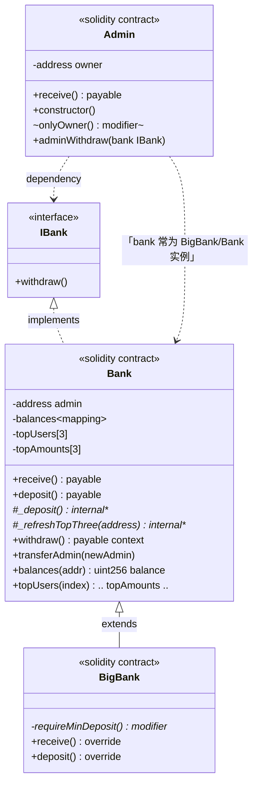
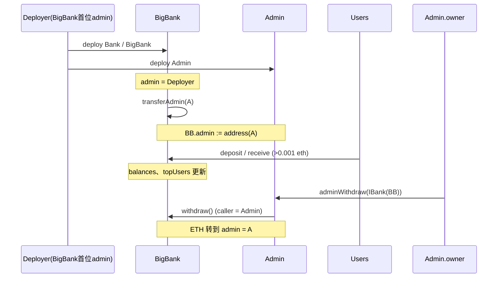

# L5 Bank / BigBank / Admin — 习题类结构与说明

## 1. UML 类图（Solidity 合约视作「类」，`interface` 视作接口）

以下为 **Mermaid** 图，在 VS Code/Cursor、`GitLab`、`GitHub` 等 Markdown 预览中可渲染。若编辑器不支持预览，可参考下一节文字说明。

\* 图中的 `_deposit`、修饰器等为简略标注；Solidity 中 `withdraw`/`receive`/`deposit` 的 `payable` 与权限未在每一条线上重复写出。

---

## 2. 关系说明（对应习题要求）

### 2.1 `IBank`

- Solidity **接口**：只约束 **「有一个可被外部调用的 `withdraw()`」**。
- **`Admin`** **不继承** Bank，只 **`import IBank`**，通过 **`adminWithdraw(IBank bank)`** 传入 **Bank 或 BigBank 的实例地址**，以 **抽象类型** 调用 **`withdraw`**，体现 **面向接口编程**。

### 2.2 `Bank is IBank`

- **`Bank` 实现 `IBank`**：对外提供 **`withdraw()`** 等与接口一致的入口。
- 内部维护 **`admin`**、`balances`、`topUsers`、`topAmounts`（排行榜逻辑）。
- **`transferAdmin(address)`**：由 **`onlyAdmin`** 鉴权的管理员可把 **`admin`** 改为别的地址——**习题中最终改为部署好的 `Admin` 合约地址**。  
  此后 **`withdraw()`** 将把 Bank 合约内 **当前全部 ETH** 打到 **`payable(admin)`**，即打到 **Admin 合约**。

### 2.3 `BigBank is Bank`

- **继承 (`extends`)** **`Bank`**，复用记账、排行榜、**`withdraw` / `transferAdmin`**。
- **附加约束**：重写 **`receive` / `deposit`**，挂载修饰器 **`requireMinDeposit`**，要求每笔 **`msg.value > 0.001 ether`**；不满足则 **`revert`**。
- 「**支持转移管理员**」来自 **父类 **`Bank`** 的 **`transferAdmin`**，不需在 **`BigBank`** 里重写。

### 2.4 `Admin`（独立合约）

- 维护 **`owner`**（部署时为 **`msg.sender`**），**`adminWithdraw(IBank bank)`** 带 **`onlyOwner`**。
- 调用 **`bank.withdraw()`** 时：**`msg.sender`** 必须是 **`withdraw` 允许的 admin**——因此需事先 **`transferAdmin(address(Admin))`**。
- **`withdraw`** 将把资金转到 **`bank` 记录在链上的 **`admin`** 字段**；当它等于 **`Admin` 实例地址** 时，**ETH 记在 `Admin.balance`**，等价于习题所述「**转到 Admin 合约地址**」。  
- **`receive() payable`** 用于接收 **`call{value}`**（本练习中即从 Bank 转来的 ETH）。

---

## 3. 典型运行时序（与本类图对应）

---

## 4. 小结（对照表）

| 类型 | 角色 |
|------|------|
| `IBank` | 提款能力的抽象，`Admin` 只依赖它不依赖具体合约实现。 |
| `Bank` | 活期存款 + Top3；**可变 `admin`**；**实现 `withdraw` + `transferAdmin`**。 |
| `BigBank` | `Bank` **子类**，用 **modifier** 加 **单笔存款下限**。 |
| `Admin` | **所有者**触发 **`bank.withdraw()`**；需 **`BigBank.admin == Admin`**，资金进到 **`Admin` 合约**。 |

---

*文件名：`习题类结构说明.md`，与同目录下的 `Bank.sol`、`bigBank.sol`、`IBank.sol`、`Admin.sol` 对应。*
